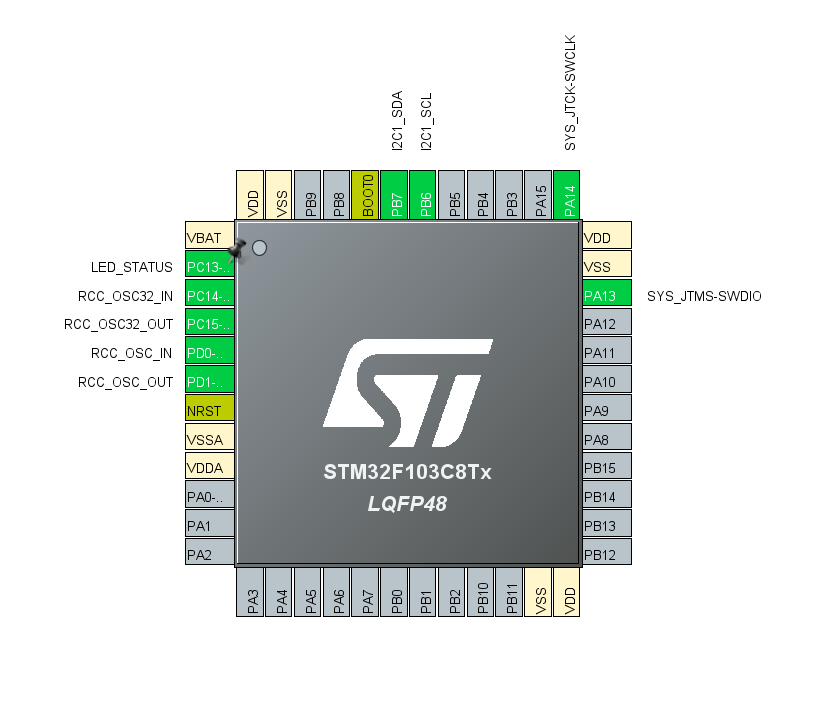
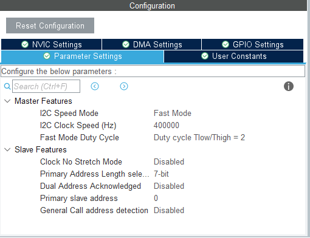

# Módulo MPU6050 no STM32F103C8T6 (BluePill) utilizando Filtro de Kalman

O objetivo será testar o módulo e estudar o seu funcionamento para aplicarmos no código principal do Drone.

## Sumário
- [Princípio de Funcionamento](#princípio-de-funcionamento)
- [Configuração Inicial e Pinagens](#configuração-inicial-e-pinagens)
- [Código](#código)

## Princípio de Funcionamento

O MPU6050 utiliza o protocolo I2C, ou seja utiliza dois fios de onde um diz respeito ao Clock e o outro por onde passa os dados. A
diferenciação de dispositivos I2C e feita por endereços Hexadecimais. Isso e importante para o seu módulo funcionar, uma vez que fornece o
endereço errado, o módulo não funciona.

Para acessar-mos as informações que os sensores coletam, primeiro deve-se inicializar o módulo. Com o módulo pronto, inicia-se 
a leitura dos dados dos sensores em um buffer de 6 bits previamente declarado. Após isso, trate esses dados. 

## Configuração Inicial e Pinagens

A configuração no IOC e as pinagens serão *Setadas* da seguinte forma:



Atente-se as Configurações de parâmetros do I2C:



## Código

Após salvar o IOC gerar seu código, na `main.c` iremos inicialmente definir as configurações para o MPU6050:

```c
/* Private define ------------------------------------------------------------*/
/* Configuração inicial MPU6050 */ 
#define MPU6050_ADDR       0x68 << 1 // AD0 GND => 0x68 << 1 ; AD0 VCC => 0x69 << 1 
#define ACCEL_XOUT_H_REG   0x3B 
#define GYRO_XOUT_H_REG    0x43 
```

Atente-se somente em qual pino o AD0 está conectado no seu projeto para definir corretamente o endereço do MPU. Após as configurações iniciais, é importante criar os buffers para o armazenamento dos dados:

```c
// Buffer para armazenar os dados
uint8_t accel_data[6];
uint8_t gyro_data[6];
```
Aqui utilizarei somente o Acelerômetro e Giroscópio, porém para utilizar o sensor de temperatura é o mesmo princípio. Precisamos agora inicializar o módulo para começar a armazenar a coleta dos dados.

Para realizar uma verificação se o MPU está se comunicando com o microcontrolador, no `main(void)`: (**OPCIONAL**)

```c
  /* Initialize all configured peripherals */
  MX_GPIO_Init();
  MX_I2C1_Init();
  /* USER CODE BEGIN 2 */

  // Inicia (acorda) o MPU6050
  uint8_t wake = 0x00;
  HAL_I2C_Mem_Write(&hi2c1, MPU6050_ADDR, 0x6B, 1, &wake, 1, HAL_MAX_DELAY);

  // --- Teste de conexão com MPU6050 ---


  uint8_t check = 0;
  HAL_StatusTypeDef ret;

  ret = HAL_I2C_Mem_Read(&hi2c1,
						 MPU6050_ADDR,   // endereço do MPU6050
						 0x75,          // registrador WHO_AM_I
						 I2C_MEMADD_SIZE_8BIT,
						 &check,
						 1,
						 1000);


  if (ret == HAL_OK && check == 0x68) {
	  // Conseguiu falar com o MPU6050
	  HAL_GPIO_WritePin(GPIO, GPIO_PIN_13, GPIO_PIN_SET); // acende LED

  }
  else{
		// Não conseguiu falar
	  for (int i = 1; i < 5; i++){
		  HAL_GPIO_TogglePin(GPIOC, GPIO_PIN_13);  // Pisca o LED (5 vezes a cada 1 segundo)
		  HAL_Delay(1000);
	  }
  }	
```
Caso queira apenas pular esta parte e inicializar o MPU sem verificações:

```c
/* Initialize all configured peripherals */
	MX_GPIO_Init();
	MX_I2C1_Init();
/* USER CODE BEGIN 2 */

// Inicia (acorda) o MPU6050
	uint8_t wake = 0x00;
	HAL_I2C_Mem_Write(&hi2c1,
	                  MPU6050_ADDR,   // endereço do MPU6050 com AD0 em GND
	                  0x6B,          // registrador PWR_MGMT_1
	                  I2C_MEMADD_SIZE_8BIT,
	                  &wake,
	                  1,
	                  HAL_MAX_DELAY);
```

Na a biblioteca `HAL`, utilizaremos a função `HAL_I2C_Mem_Read()` dentro do `While(1)` para armazenar os dados, coletados e salvos no registrador do MPU, nos buffers.

```c
/* Infinite loop */
  /* USER CODE BEGIN WHILE */
  while (1)
  {

	  HAL_I2C_Mem_Read(&hi2c1, MPU6050_ADDR, ACCEL_XOUT_H_REG, 1, accel_data, 6, HAL_MAX_DELAY);
	  HAL_I2C_Mem_Read(&hi2c1, MPU6050_ADDR, GYRO_XOUT_H_REG, 1, gyro_data, 6, HAL_MAX_DELAY);

```

Após isso, basta tratar esses dados da forma que for conveniente. Aqui iremos converter esses dados em `float` e após isso converte-los em unidades físicas. Para isso iremos declarar as definições e variáveis no início do código:

```c
/* Private define ------------------------------------------------------------*/
/* USER CODE BEGIN PD */

// Constantes de conversão
#define ACCEL_SCALE 16384.0f   // LSB/g (para ±2g)
#define GYRO_SCALE  131.0f     // LSB/(°/s) (para ±250°/s)
#define GRAVITY     9.80665f   // m/s²
```

```c
// Buffer para armazenar os dados
int16_t accel_x, accel_y, accel_z, gyro_x, gyro_y, gyro_z;
uint8_t accel_data[6];
uint8_t gyro_data[6];

// Variáveis em float (convertidas)
float ax_ms2, ay_ms2, az_ms2;   // aceleração em m/s²
float gx_dps, gy_dps, gz_dps;   // giroscópio em °/s

```

e em seguida tratamos esses dados após o armazenamento no buffer:

```c
  while (1)
  {
    /* USER CODE END WHILE */

	  HAL_I2C_Mem_Read(&hi2c1, MPU6050_ADDR, ACCEL_XOUT_H_REG, 1, accel_data, 6, HAL_MAX_DELAY);
	  HAL_I2C_Mem_Read(&hi2c1, MPU6050_ADDR, GYRO_XOUT_H_REG, 1, gyro_data, 6, HAL_MAX_DELAY);

	  	    // Converte os dados
	  	    accel_x = (int16_t)(accel_data[0] << 8 | accel_data[1]);
	  	    accel_y = (int16_t)(accel_data[2] << 8 | accel_data[3]);
	  	    accel_z = (int16_t)(accel_data[4] << 8 | accel_data[5]);

	  	    gyro_x = (int16_t)(gyro_data[0] << 8 | accel_data[1]);
	  	    gyro_y = (int16_t)(gyro_data[2] << 8 | accel_data[3]);
	  	    gyro_z = (int16_t)(gyro_data[4] << 8 | accel_data[5]);

	  	   // Converte para float em unidades físicas (m/s² e graus/s);
	  	    ax_ms2 = ((float)accel_x / ACCEL_SCALE) * GRAVITY;
	  	    ay_ms2 = ((float)accel_y / ACCEL_SCALE) * GRAVITY;
	  	    az_ms2 = ((float)accel_z / ACCEL_SCALE) * GRAVITY;

	  	    gx_dps = (float)gyro_x / GYRO_SCALE;
	  	    gy_dps = (float)gyro_y / GYRO_SCALE;
	  	    gz_dps = (float)gyro_z / GYRO_SCALE;


    /* USER CODE BEGIN 3 */
  }
  /* USER CODE END 3 */
}
```

Basta debuggar e observar os valores no Live Expressions do STMCUBEIDE.
